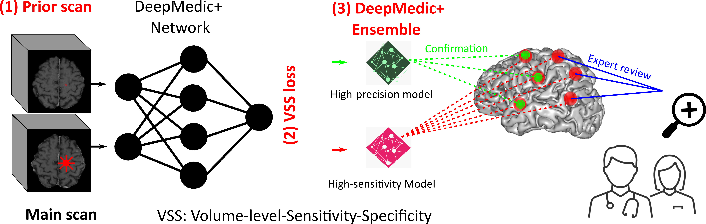

# DeepMedic+
## Deep learning for brain metastasis detection and segmentation in longitudinal MRI data
This is the official code repository for our Medical Physics paper "Deep learning for brain metastasis detection and segmentation in longitudinal MRI data": https://doi.org/10.1002/mp.15863
 
 The backbone of our implementation is from the [original DeepMedic repository](https://github.com/deepmedic/deepmedic). Therefore, almost all the instructions from the original DeepMedic repository still apply to our implementation.
 
 ## Citation
 To use these codes, please cite our paper:
 
 [1] Y. Huang, C. Bert, P. Sommer, B. Frey, U. Gaipl, L. V. Distel, T. Weissmann, M. Uder, M. A. Schmidt, A. Dörfler, A. Maier, R. Fietkau, and F. Putz, “Deep learning for brain metastasis detection and segmentation in longitudinal mri data,” Medical Physics, vol. 49, no. 9, pp. 5773–5786, 2022.
 
 Latex Bibtex:  
 @article{huang2022deep,  
 author = {Huang, Yixing and Bert, Christoph and Sommer, Philipp and Frey, Benjamin and Gaipl, Udo and Distel, Luitpold V. and Weissmann, Thomas and Uder, Michael and Schmidt, Manuel A. and Dörfler, Arnd and Maier, Andreas and Fietkau, Rainer and Putz, Florian},  
 title = {Deep learning for brain metastasis detection and segmentation in longitudinal MRI data},  
journal = {Medical Physics},  
volume = {49},  
number = {9},  
pages = {5773-5786},  
keywords = {brain metastasis, deep learning, ensemble, loss function, MRI, sensitivity specificity},  
doi = {https://doi.org/10.1002/mp.15863},  
url = {https://aapm.onlinelibrary.wiley.com/doi/abs/10.1002/mp.15863},  
eprint = {https://aapm.onlinelibrary.wiley.com/doi/pdf/10.1002/mp.15863},  
year = {2022}  
}  

## Graphical abstract



## Contents
This repository contains our DeepMedic+ implementation with prior volumes and proposed volume-level sensitivity-specificity (VSS) loss, as well as the pretrained high-sensitivity and high-precision model weights.
For retraining on your own datasets, our preprocessing pipeline is also shared.

#### VSS loss
The VSS loss is located at [here](./DeepMedicPlus/deepmedic/neuralnet/cost_functions.py).

#### Pretrained models
Pretrained models are located at 
[DeepMedicDualPath\examples\output\saved_models\pretrainedModels](./DeepMedicPlus/examples/output/saved_models/pretrainedModels/)

The high sensitivity model is: deepMedicWide1.high_sensitivity.model.ckpt  
The high precision model is: deepMedicWide1.high_precision.model.ckpt

#### Data structure for inference/test
Put the main test volume paths in [.\examples\configFiles\deepMedicPlus\test\testChannels_t1c.cfg](./DeepMedicPlus/examples/configFiles/deepMedicPlus/test/testChannels_t1c.cfg)  

put the corresponding prior volume paths in [.\examples\configFiles\deepMedicPlus\test\testPriorChannels_t1c.cfg](./DeepMedicPlus/examples/configFiles/deepMedicPlus/test/testPriorChannels_t1c.cfg)

If **no prior volume**, simply put the path to a volume with Zero values only. The zero-value volume we used is shared here named "!!AAZero_Volume.nii.gz".

#### Data preprocessing pipeline  
In order to directly apply our pretrained models, your test data should have the same [preprocessing pipeline](./Brain_MRI_Preprocessing_pipeline/) as ours.
Hopefully your MRI sequence is also T1 MPRAGE or other similar T1 sequences.
Otherwise, the performance of using our pretrained models will be suboptimal, due to different image styles.

#### Command line for inference/test with pretrained models
```python
python deepMedicRun -model ./examples/configFiles/deepMedicPlus/model/modelConfig_wide1_deeper.cfg -test ./examples/configFiles/deepMedicPlus/test/testConfig.cfg -load ./examples/output/saved_models/deepMedicWide1.high_sensitivity.model.ckpt -dev cuda0
```
```python
python deepMedicRun -model ./examples/configFiles/deepMedicPlus/model/modelConfig_wide1_deeper.cfg -test ./examples/configFiles/deepMedicPlus/test/testConfig.cfg -load ./examples/output/saved_models/deepMedicWide1.high_precision.model.ckpt -dev cuda0
```

For Windows users, you can also use [runCMDs.py](./DeepMedicPlus/runCMDs.py) to run multiple commands.
